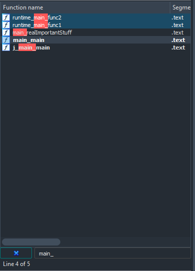
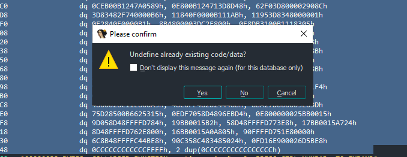
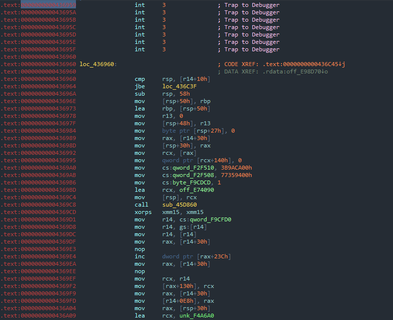

# Operation Hide n Seek

**Description: In this challenge, you will reverse engineer a golang implant and confirm if its related to the DarkKittens latest malware sample: GODark**

Our threat intelligence team has been monitoring the DarkKittens hacking group closely after their recent attacks on our infrastructure. 
Their initial payloads seem to get past our threat signatures, but our EDR flags them as they attempt to inject their final stage.

The threat hunting team has identified some anomalyous behaviour at one our of remote satellite facilities where our cold storage backups are located.
The main IT administrator has been on leave this past week, but his account seems to login in consistently during off hours.

Due to his level of access to the facility and IT infrastructure a breach using his credentials would be catosphrophic. The IT team has suspended his account,
but we fear it may be too late.

Our lead digital forensics expert onsite was able to extract this anomalous payload from the memory of our main "Backup" application.

Recent attacks by the DarkKittens have shown a higher-level of sophistication in their final "Stage 2" implants that are being deployed. 
They've been known to obfuscate their implants with the tool `garble`, which is currently the standard for golang.

One of our level-1 malware analysts has spent the last 4 hours trying to get past the obfuscation used in this sample with no luck. 

**Time is of the essence and we need an answer now!**

We need you to find a method of getting past `garble's` obfuscation and identify the entry point of the actual malicious code.

1. Double-click the `MaybeBad.bin.i64`. This will open up the IDA Pro project file our Malware analyst started. Unfortunately, he couldn't identify where the malicious code started due to the obfuscation. It's up to you to finish his work.

2. You'll notice the sample appears to be heavily obfuscated and hard to decipher where they entry point is to the actual sample. Open up `Good.bin.i64` and compare the functions between these two files. You should see 2 custom functions named `main_main` and `main_realImportantStuff`.



The `main_main` function is where the user-code starts. If you can't find this, you'll probably looking a library functions that come standard with the golang runtime.

`Garble` is the most common and prevalent obfuscation tool used for Golang. Its main goal is to obfuscate where the user-code is, and confuse the analyst with all the bloat of the standard golang runtime.

3. Based on this, this technique was probably used by the malware authors. Look at the file named `goRuntime.yara`. The most important rule in this file is `runtime_main`. 

This yara rule was built based on lots of reverse engineering and research into `Garble` and how it obfuscates its binaries.


```
...
rule runtime_main {
    strings:
        $inc = { FF 80 3C 02 00 00 49 }
        $system_stack = { 48 C7 05 ?? ?? ?? ?? ?? CA 9A 3B 48 C7 05 }
        $load_main_main = { 48 8B 05 ?? ?? ?? ?? 48 8D 15 ?? ?? ?? ?? FF D0 }

    condition:
        all of them
}
...
```
The `runtime_main` function is used by the golang runtime to load `main_main`. If we can find this function, we find our entry point.

We will use the `$load_main_main` signature in IDA Pro to find our target function. 

**Remember `main.main` is where the "user-code" begins (i.e malware's main code)**

4. Go back to your open IDAPro windows for `MaybeBad.bin.i64`.  
Using the top menu, hit: 
    - `Search->Sequence of bytes...`
    - String field: `48 8B 05 ?? ?? ?? ?? 48 8D 15 ?? ?? ?? ?? FF D0`
    - click the checkbox:  `Find all occurrences`


5. Once you clicked search, you should get greeted with a "nice" blob of bytes. IDA couldn't identify a function here. Garble's good huh? We will have to patch this in order to continue reverse engineering.
    - Highlight the section with your mouse starting with `align 20h` and ending with `dq 0CCCCCCCCCCCCFFFFh, 2 dup(0CCCCCCCCCCCCCCCCh)`
    - Right-click with your mouse on the selected range and select `Analyze selected area`
    
    - It will prompt you with a question, click `Force`
    
    - The last question will state: `"Undefine already existing code/data?"`.. It sounds scary, but go ahead and click `Yes`
    


6. Now that we've told IDA to force re-analyze that section, it dumps some assembly. Notice the section starting with `loc_`. The numbers after the underscore are related to the file offset, and won't always be the same.

    - Click on the new disassembly section labeled `loc_`. 
    - Type `p` on your keyboard. This is a shortcut to convert this section to a new function
    - Finally, hit the spacebar. This will bring up the graph view for IDA.

7. Know that we have patched the function, go ahead and use the same search feature as before. You'll notice there should be only one result.
    - `Search->Sequence of bytes...`
    - String field: `48 8B 05 ?? ?? ?? ?? 48 8D 15 ?? ?? ?? ?? FF D0`
    - click the checkbox:  `Find all occurrences`
    - Double-click on the one result: `sub_438620`


8. Take a closer look and the block selected.. You should see a `call` instruction here. The function `sub_557C40` is our `main_main`. 
    - Double-click on `sub_557C40` and take a look around.
    - Its a pretty small function with a interesting loop near the bottom.


 **Congratulations! You've made it to the first step of analyzing obfuscated golang malware... Finding the entry point.!**

To really appreciate your accomplishment, look at `GoDark_clean.exe` to see all the symbolic information left by the golang compiler. You can easily find `runtime_main` and `main_main`. There will even be useful function names used by the malware authors. You can see why the try very hard to obfuscate their payloads as much as possible.

Something obvious to note would be.. well we could have just done a string search and look for weird or interesting strings like `GODark initalizing`. But, in reality all those strings are encrypted and there are no easy indicators!

Good job and well done.

## Extra Credit:

In the challenges folder is a file labeled `OneDrive.exe`. This is a very sophisticated shellcode loader that the hacking group saves for their high valued targets. It uses the **ScareCrow** framework to perform a list of evasion techniques before loading the shellcode. One of which is `Garble`.

Our team found it dormint on the lead engineer's laptop. They believe this is where the **GoDark** payload came from. Can you extract the embedded shellcode from the loader and validate the payload?


